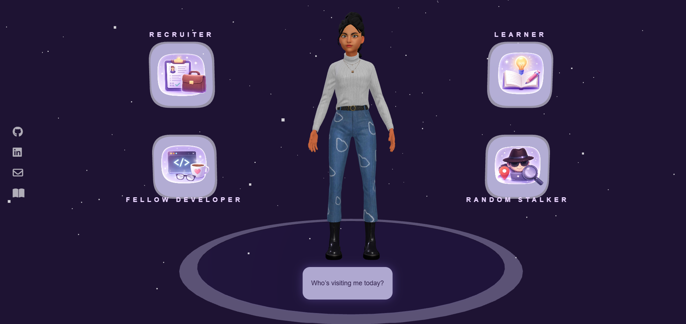

# 🌌 Mahimaa Portfolio

> **A cinematic, story-driven developer portfolio that transforms a traditional resume into an interactive digital experience.**

<p align="center">
  
</p>

<p align="center">


</p>

---

# ✨ Why This Portfolio?

Most portfolios answer one question:

> **"What has this person built?"**

This portfolio attempts to answer something deeper:

> **"Who is the engineer behind those projects?"**

Rather than navigating static webpages, visitors experience multiple story-driven journeys designed for different audiences—whether they are recruiters, developers, fellow learners, or simply curious visitors.

The objective isn't just to showcase projects.

It's to create an experience people remember.

---

# 🎬 Portfolio Experience

Instead of presenting everything on a single webpage, the portfolio offers multiple immersive journeys.

---

## 🎥 Recruiter Journey

Designed for recruiters who want a concise overview of my engineering work.

This experience highlights:

- 🚀 Featured Projects
- 🏆 Engineering Milestones
- 📄 Research
- ⚙️ Technical Skills
- 📑 Resume
- 📬 Contact

Instead of a traditional timeline, milestones are presented as an interactive engineering journey.

---

## 💻 Developer Workspace

Inspired by modern developer environments.

Visitors explore my work through a VS Code–inspired workspace featuring interactive datasets such as:

```text
projects.json
skills.json
research.json
timeline.json
achievements.json
experience.json
```

The goal is to let visitors explore my portfolio the same way developers explore a codebase.

---

## 📚 Learner

A space dedicated to curiosity rather than achievements.

It explores:

- Artificial Intelligence
- Robotics
- Computer Science
- System Design
- Research Papers
- Books
- Learning Roadmap
- Lessons from Projects & Hackathons

Because learning never stops.

---

## 🌙 Stalker Mode

A cinematic introduction for visitors who simply want to know the person behind the projects.

This journey explores my interests, personality, values, motivations, and engineering philosophy before leading into MahimaaAI.

---

## 🤖 MahimaaAI

MahimaaAI is an AI-powered digital twin trained exclusively on a curated knowledge base about my projects, research, experiences, and interests.

Visitors can ask questions about:

- Projects
- Research
- Technologies
- Hackathons
- Skills
- Engineering Journey
- Personal Interests

Instead of generating generic responses, MahimaaAI retrieves relevant context from structured datasets before generating answers, making conversations more grounded and personalized.

---

# 🚀 Features

- 🌌 Story-driven navigation
- 🤖 AI-powered digital twin
- 🧠 Retrieval-Augmented Generation (RAG)
- 🎭 Interactive 3D Ready Player Me avatar
- 💬 Context-aware conversations
- ✨ Typewriter chat experience
- 🌠 Three.js powered interactions
- 💻 VS Code-inspired developer workspace
- 🎬 Cinematic animations & transitions
- 📱 Responsive design
- ⚡ Modern UI & visual effects

---

# 🛠 Tech Stack

| Category | Technologies |
|-----------|--------------|
| **Frontend** | HTML5, CSS3, TypeScript, Vite |
| **3D** | Three.js, GLTF, FBX Animations, Ready Player Me |
| **Backend** | Python, Flask |
| **AI** | Google Gemini API, Prompt Engineering, Retrieval-Augmented Generation |
| **Data** | Structured JSON Knowledge Base |

---

# 📂 Project Structure

```text
frontend/
│
├── landing/
├── recruiter/
├── developer/
├── learner/
├── stalker/
├── mahimaaAI/
└── assets/

backend/
│
├── dataset/
│   ├── knowledge/
│   └── personality/
│
├── brain/
├── retriever.py
├── chat.py
├── app.py
└── prompt.py
```

---

# 🧠 MahimaaAI Architecture

```text
               User
                 │
                 ▼
      Interactive Frontend
                 │
                 ▼
            Flask API
                 │
                 ▼
      Intent Classification
                 │
                 ▼
     Knowledge Retrieval (RAG)
                 │
                 ▼
       Relevant Context Builder
                 │
                 ▼
        Google Gemini API
                 │
                 ▼
          Contextual Response
                 │
                 ▼
             MahimaaAI
```

---

# 💡 Inspiration

The initial idea of organizing visitors into different personas—**Recruiter**, **Developer**, **Learner**, and **Stalker**—was inspired by the creative portfolio concept developed by **Sumanth Samala**.

While that navigation concept served as the starting point, this project evolved into an independent implementation featuring its own storytelling approach, AI-powered digital twin, Three.js experiences, backend architecture, curated datasets, immersive UI, and interactive engineering workflows.

Special thanks for inspiring me to think differently about what a portfolio can be.

---

# 🎯 Purpose

This project explores the intersection of:

- Artificial Intelligence
- Human–Computer Interaction
- Storytelling
- Full-Stack Development
- Interactive Web Experiences

Rather than treating a portfolio as a collection of webpages, this project experiments with presenting an engineer's journey through immersive interactions.

---

# 🔮 Roadmap

- Voice Conversations
- Facial Expressions
- Lip Synchronization
- Emotion-aware Responses
- Eye Tracking
- Voice Input
- Multi-language Support
- More Interactive Experiences

---

# 👩‍💻 About Me

I'm **Mahimaa Prajapati**, a Computer Science undergraduate passionate about building intelligent systems at the intersection of **Artificial Intelligence, Robotics, Full-Stack Development, and Geospatial Intelligence**.

I enjoy solving meaningful engineering problems through hands-on projects while continuously exploring new technologies and challenging myself beyond my comfort zone.

---

# ⭐ Support

If you enjoyed exploring this project, consider giving it a **⭐ Star** on GitHub.

It helps others discover the project and motivates future improvements.

---

> *"Every milestone behind me was once a goal ahead of me."*
